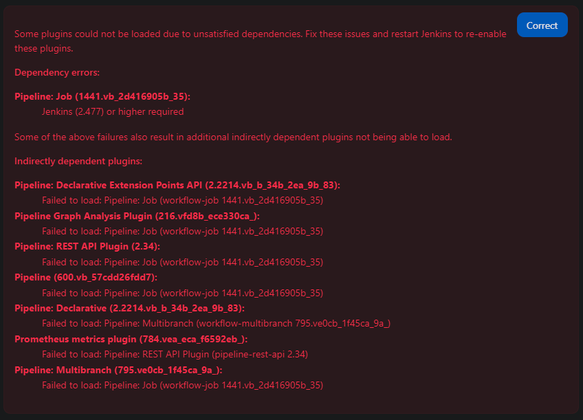

# Registry1 Bug

For some reason when running the `registry1` flavor of Jenkins, the plugins that come with the base list will not sync their version properly. What this means is the plugin will update and expect a newer version of Jenkins than what is actually being deployed. Sometimes this will prevent Jenkins from deploying, other times it might break functionality within the GUI but the container will report healthy.

## Bug Example

The following are lists of plugins that were automatically added to Jenkins from the values.yaml when it was deployed:

- [Upstream-Plugin-List](bug-examples/upstream-plugin-list.txt)
- [Registry1-Plugin-List](bug-examples/registry1-plugin-list.txt)

Both of the flavors used this list of plugins:

```yaml
  installPlugins:
    - kubernetes:4287.v73451380b_576
    - workflow-aggregator:600.vb_57cdd26fdd7
    - git:5.2.2
    - configuration-as-code:1850.va_a_8c31d3158b_
    - oic-auth:4.340.ve70636c6590e
    - prometheus:784.vea_eca_f6592eb_
    - cloudbees-disk-usage-simple:203.v3f46a_7462b_1a_
    - saml:4.487.v9f1c3328f1c0
    - okhttp-api:4.11.0-181.v1de5b_83857df
```

The `registry1` flavor list is missing the following plugins:

```yaml
    - pipeline-graph-analysis:216.vfd8b_ece330ca_
    - pipeline-model-definition:2.2214.vb_b_34b_2ea_9b_83
    - pipeline-model-extensions:2.2214.vb_b_34b_2ea_9b_83
    - pipeline-rest-api:2.34
    - prometheus:784.vea_eca_f6592eb_
    - workflow-aggregator:600.vb_57cdd26fdd7
    - workflow-job:1436.vfa_244484591f
    - workflow-multibranch:795.ve0cb_1f45ca_9a_
```

In the Jenkins UI, this error appeared detailing the pipeline plugin is newer than the version of Jenkins deployed (`jenkins:2.476-jdk17` was deployed):



This is the zarf yaml used (please not that the versions of the images are the same):

```yaml
  - name: jenkins
    required: true
    description: "Deploy jenkins with upstream images"
    import:
      path: common
    only:
      flavor: upstream
      cluster:
        architecture: amd64
    charts:
      - name: jenkins
        valuesFiles:
          - values/upstream.yaml
    images:
      - docker.io/jenkins/jenkins:2.476-jdk17
      - docker.io/kiwigrid/k8s-sidecar:1.27.6
      - docker.io/jenkins/inbound-agent:3256.v88a_f6e922152-1

  - name: jenkins
    required: true
    description: "Deploy jenkins with registry1 images"
    import:
      path: common
    only:
      flavor: registry1
      cluster:
        architecture: amd64
    charts:
      - name: jenkins
        valuesFiles:
          - values/registry1.yaml
    images:
      - registry1.dso.mil/ironbank/opensource/jenkins/jenkins:2.476-jdk17
      - registry1.dso.mil/ironbank/opensource/jenkins/inbound-agent:3186.vc3b_7249b_87eb_-1
      - registry1.dso.mil/ironbank/kiwigrid/k8s-sidecar:1.27.6
```

## Workaround/Fix

To deal with this issue, the `installPlugins` key will be added to the `registry1` flavor of the `values.yaml` to pin any problematic versions that may arise. This will require more overhead to maintain but will make for a more stable product.
